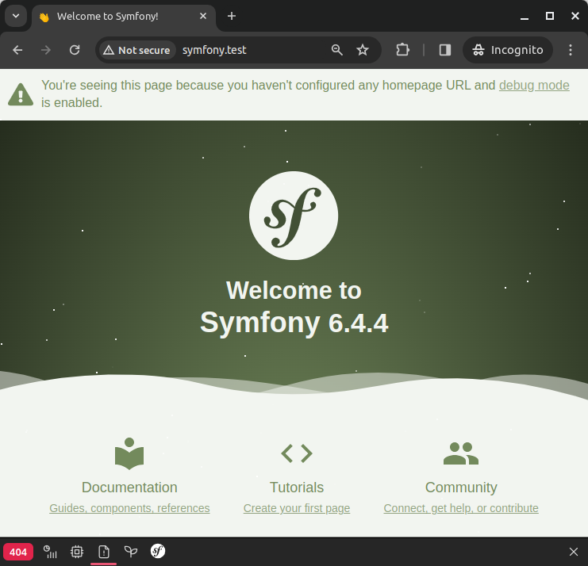
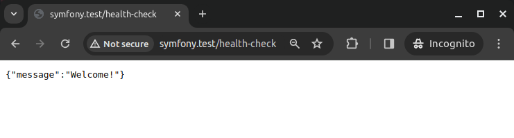
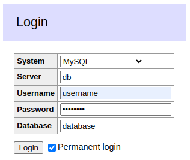
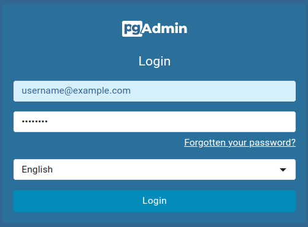
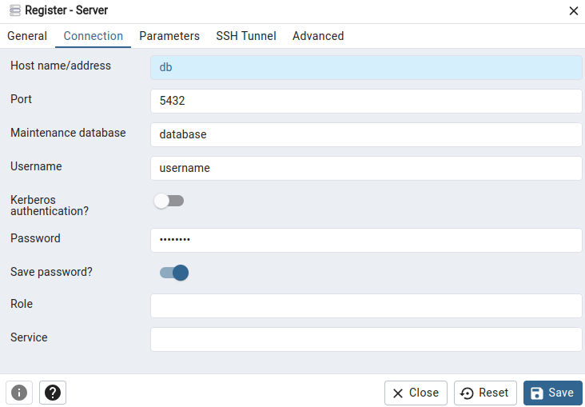

# Docker PHP, Nginx, [MySQL | MariaDB | PostgreSQL]

> Only for DEV, not for production!

| 	        | 	                                              |
|:---------|:-----------------------------------------------|
| PHP      | `PHP 8.2`, `PHP 8.3`                           |
| Database | `MySQL 8.0`, `MariaDB 11.3.2`, `PostgreSQL 16` |
| Server   | `Nginx 1.25`, `nginx-proxy 1.5`                |
| Tools    | `XDebug 3.3.1`, `Adminer`, `pdAdmin 4`         |

## Setup Project

Clone repository

```
git clone git@github.com:amberlex78/symfony-docker.git && cd symfony-docker
```

For MySQL

```
cp compose.override.yaml.mysql compose.override.yaml && cp .env.mysql .env
```

For MariaDB

```
cp compose.override.yaml.mariadb compose.override.yaml && cp .env.mariadb .env
```

For PostgreSQL

```
cp compose.override.yaml.postgre compose.override.yaml && cp .env.postgre .env
```

Setting in the `project/.env` file

```
cp project/.env.dist project/.env
```

Uncomment the corresponding line with `DATABASE_URL` in the `project/.env` file.

Install

```
make install
```

## Config

See virtual hosts `NGINX_VIRTUAL_HOST`, `ADMINER_VIRTUAL_HOST` in the `.env` file.

Add lines to the `/etc/hosts` file corresponding to the virtual hosts:

```
127.0.0.1 symfony.test
```

In browser go to the `symfony.test`



In browser go to the `symfony.test/health-check`



> P.S. My `/etc/hosts` file for different projects:

```
127.0.0.1 example.test
127.0.0.1 project.test

127.0.0.1 symfony.test
127.0.0.1 laravel.test

127.0.0.1 adminer.test
127.0.0.1 pgadmin.test
```

## Connect to Database

### MySQL or MariaDB

In browser go to the `adminer.test`

```
Server:   db
Username: username
Password: password
Database: database

```



### PostgreSQL

In browser go to the `pgadmin.test`

```
Email:    username@example.com
Password: password
```

> These credentials are set in the `compose.override.yaml`



Then `Add New Server` and fill in the form:



> These credentials are set in the `.env` file

## Makefile commands

To show available commands, type `make`

---
P.S. My `/etc/hosts` file for different projects:

```
127.0.0.1 example.test
127.0.0.1 project.test

127.0.0.1 symfony.test
127.0.0.1 laravel.test

127.0.0.1 adminer.test
127.0.0.1 pgadmin.test
```